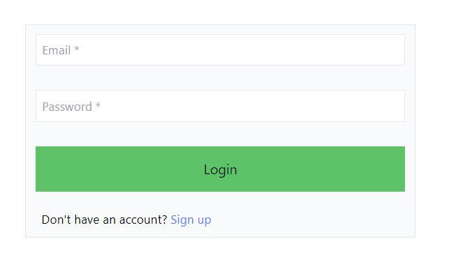
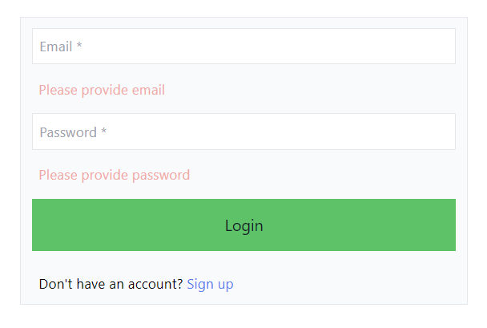
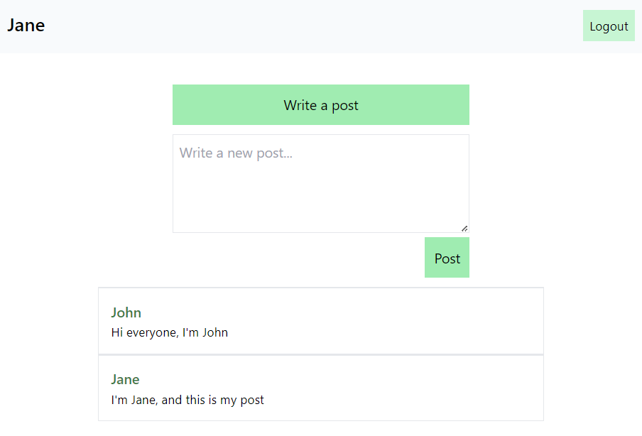

# User Authentication and Registration System with Dashboard and Post Management

This PHP project provides a user authentication and registration system with a dashboard for users to manage and create posts. It uses a MySQL database to store user information and posts.

The UI is styled with TailwindCSS using the [Tailwind cli](https://tailwindcss.com/blog/standalone-cli). The bash script `tw.sh` calls the tailwind executible and converts the classes in the markup into CSS in the `style.css`.

## Features

- User login: Users can log in using their email and password.

  

- User registration: New users can register by providing their first name, last name, email, and password. The system checks if the email is already registered.

- Form validation: PHP validation is implemented to ensure that form inputs are valid and meet certain criteria.

  

- Dashboard: Upon successful login, users are redirected to their dashboard, where they can manage their posts.

- Post management: Users can create new posts, which are stored in the database. All posts are displayed on the dashboard.

  

- Logout: Users can log out of their account, which redirects them to the login page

## Technologies Used

- PHP 8
- MySQL
- TailwindCSS
- JavaScript

## Future work

This project was meant to refamiliarize myself with PHP, MySQL, and their development paradigm. However, I see myself adding just a few more features to make it feel a bit more complete. These features include:

- Passwords are not stored in the db but instead are put through a hashing algorithm
- Users can delete their own posts
- Users can comment on posts
- Posts are saved into the db with a date in which they were inserted
- Users can 'like' posts
- Users can search and filter posts 

## Author

- Raphael

Feel free to report issues and provide feedback!
